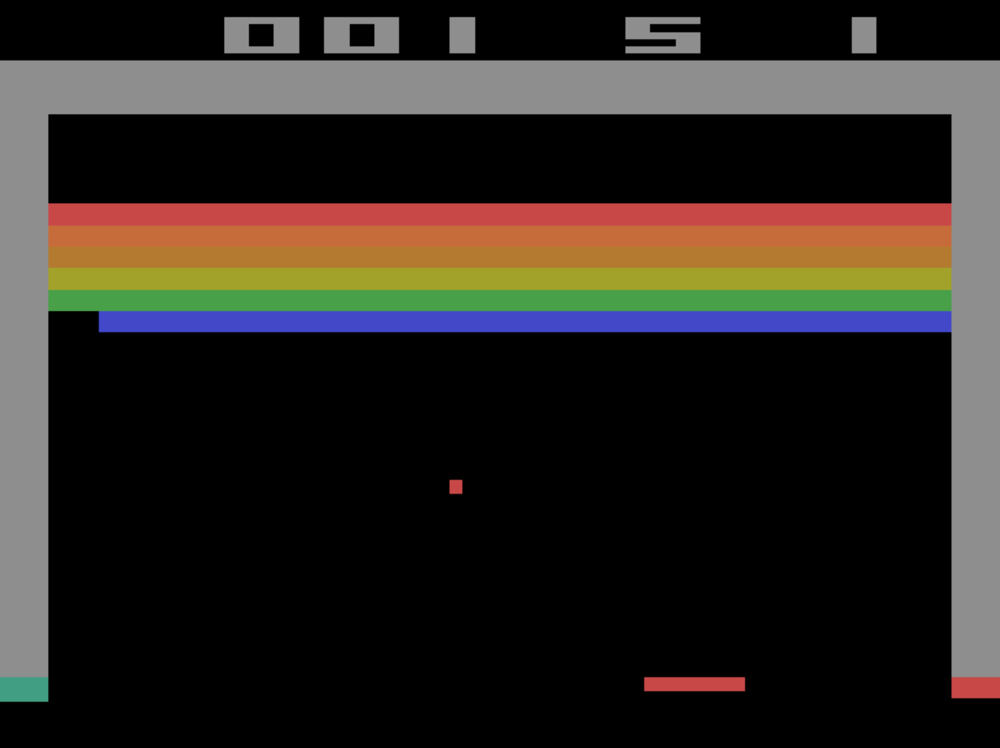

# Deep Q-Learning



## Overview
This project uses Deep Q-Learning to solve some of the RL environments with a discrete action space in Farama's Gymnasium. This includes some classic control problems, like CartPole and MountainCar, as well as some Atari games in the Arcade Learning Environment (ALE), like Breakout.

## Quickstart
### Prerequisites
1. Install requirements via pip.
    ```bash
    pip install -r requirements.txt
    ```

### Classic Control Environments

1. To train a model for a classic control environment, run ```classic_control.py``` and specify the name of the environment. Use the ```--train``` flag, then specify both the number of episodes to train for and the name of the output file.

    ```bash
    python classic_control.py ENVIRONMENT_NAME --train EPISODES MODEL_PATH
    ```

    For example, to train on the latest version of the CartPole environment for 1000 episodes, write the following command:

    ```bash
    python classic_control.py CartPole-v1 --train 1000 cartpole_model
    ```

    This will save the model as `cartpole_model.pt`.

2. Then, to visualize the model's performance, use the ```--load``` flag, specifying the path to the model you trained.

    ```bash
    python classic_control.py ENVIRONMENT_NAME --load MODEL_PATH
    ```

    This will create a visualization of the model in the environment for 10 episodes, which resets after each episode terminates or is truncated.

### Atari Environments

1. Similar to the classic control environments, run ```atari.py``` and specify the ROM ID of the environment (this will be the name of the environment in camel case, i.e. "breakout"). Use the ```--train``` flag. Specify both the number of episodes to train for and the name of the output file.

    ```bash
    python atari.py ROM_ID --train EPISODES MODEL_PATH
    ```

    For example, to train on the Breakout environment for 10,000 episodes, write the following command:

    ```bash
    python atari.py breakout --train 10000 breakout_model
    ```

2. Use the ```--load``` flag to visualize the model, specifying the path to the model you trained. Use the full environment name with the version number.

    ```bash
    python atari.py ENVIRONMENT_NAME --load MODEL_PATH
    ```

    For example, to load a model named `breakout_model` on the Breakout environment, write the following command:

    ```bash
    python atari.py Breakout-v4 --load breakout_model
    ```

3. For the Atari environments, there is also an option to record gameplay instead of displaying it visually. Use the `--record` flag for this.

    ```bash
    python atari.py ENVIRONMENT_NAME --record MODEL_PATH
    ```

    This will record a video of the model's performance for one episode and save the video to the local directory.

4. Additionally, for Atari environments, this program allows loading and saving checkpoints for training via the `--load-checkpoint` and `--save_checkpoint` flags.

    ```bash
    python atari.py ENVIRONMENT_NAME --train 100 MODEL_PATH --load-checkpoint CHECKPOINT_1 --save-checkpoint CHECKPOINT-2
    ```

## Pretrained Environments

The following environments have pretrained models under the `pretrained/` directory:
- Classic Control
    - CartPole-v1
    - Acrobot-v1
    - MountainCar-v0
- Atari
    - Breakout-v5 (note: needs further training to reach human-level performance)

## Acknowledgments

The main algorithm behind this project, Deep Q-Learning, is based on the 2013 DeepMind paper titled ["Playing Atari with Deep Reinforcement Learning"](https://arxiv.org/abs/1312.5602).
